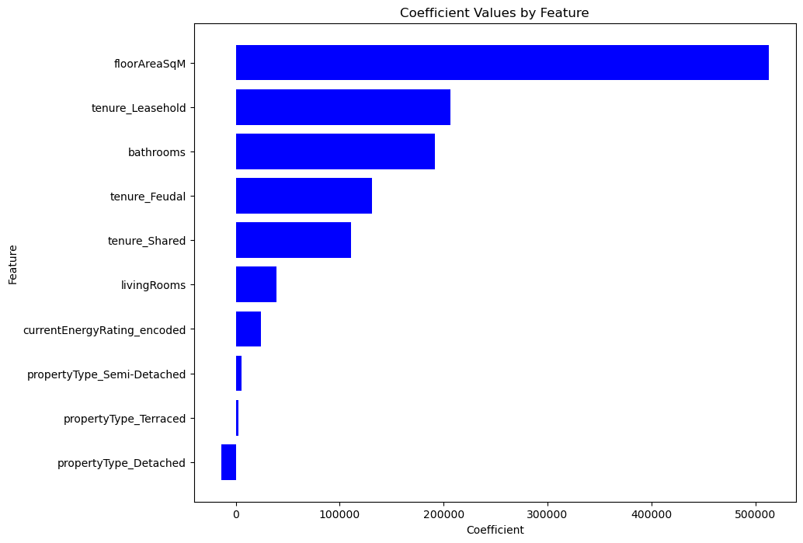

------------------------------------------------------------------------------

## London House Price Prediction
=========================

### Executive Summary
Housing properties have many attributes that can greatly influence their price such as location, number of rooms and more. This project aims to leverage the patterns presented by these attributes using machine learning methods to accurately predict London house prices. Accurate predictions are important for helping buyers, sellers, and investors better understand property values in a dynamic market.

### Impact of Solution
The final model’s predictions can serve as useful heuristics for property pricing, offering quick, data-driven estimates to support decision-making. This will assist people working in the real estate industry, such as agents, developers, and financial advisors, by providing an additional tool for assessing property values. It will also help potential buyers and sellers better understand market trends and set more informed price expectations.

### Dataset description
This dataset details information about residential properties in London, including location, property characteristics, and energy efficiency. Allowing for effective real estate analysis and property valuation across different areas. 

Link for access to original dataset:
https://www.kaggle.com/datasets/jakewright/house-price-data

### Data cleaning and pre-processing
The data must be cleaned and pre-processed in order to remove null values and redundant information, and to convert categorical or textual data into numerical formats. As machine learning models require clean, structured, and fully numeric input to function effectively.

### Proposed Solution
- Linear modelling:
    - Linear regression
    - Ridge regression
- Non-linear modelling:
    - Decision Tree regressor
    - Random forest regressor

After implementing each model, analysis and evaluation will be carried out to assess its effectiveness. This will provide insights into which model should be used next and what adjustments to the process may be needed to improve results.

### Interpretation

#### Linear modelling
Exploratory data analysis has revealed linear relationships between key features and price. To meet linear model assumptions, some features were omitted. Ridge regression improved accuracy by reducing overfitting and stabilizing coefficient values when features are correlated.

**Feature importance**

**Performance**

#### Non-linear modelling

**Feature importance**

**Performance**

#### Final Conclusion
The best performing model was the Decision Tree Regressor achieving the highest accuracy and the best generalisation to the data. Refer to '05-non-linear-modelling' notebook for further details. 

### Organization

#### Repository 

* `data` 
    Link: https://drive.google.com/drive/folders/1fV7q2s92QuqNteQTlNvH_qrSzXcF6NrC

* `model`
    - final_model.pkl
    (Saved in notebook folder)

* `notebooks`
    - 01-data-loading-cleaning
    - 02-eda
    - 03-pre-processing
    - 04-linear-modelling
    - 05-non-linear-modelling

* `docs`
    - Contains Sprint presentation PDFs

* `src`
    - Contains the project source code (refactored from the notebooks)

* `.gitignore`
    - Part of Git, includes files and folders to be ignored by Git version control

* `conda.yml`
    - Conda environment specification

* `Makefile`
    - Automation script for the project

* `README.md`
    - Project landing page (this page)

* `LICENSE`
    - Project license

------------------------------------------------------------------------------